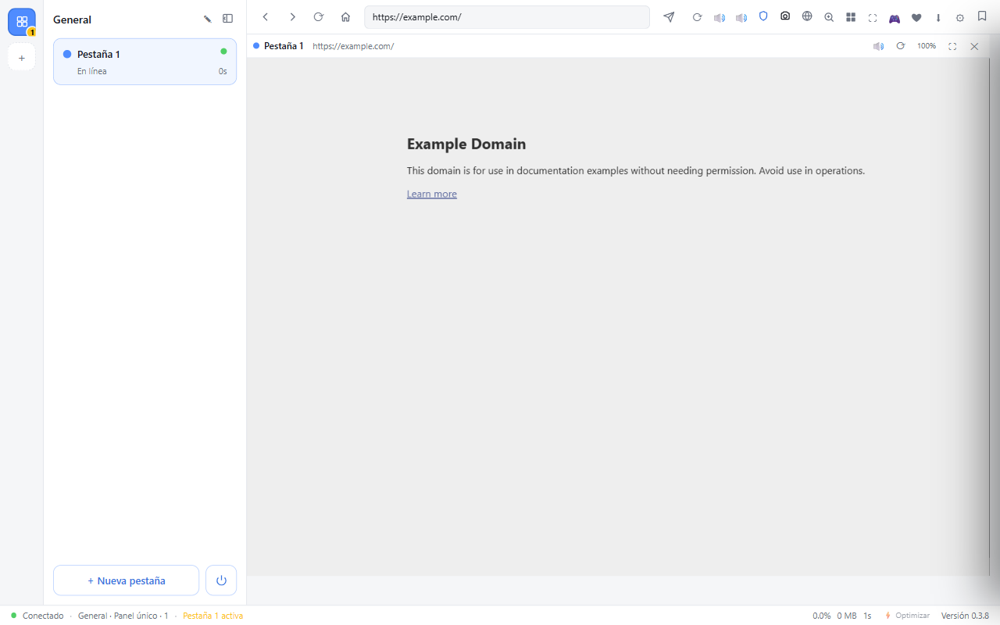
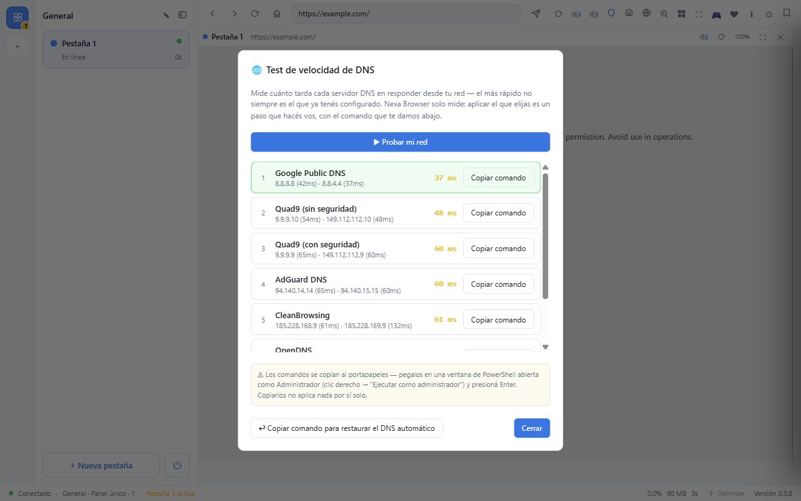

# Nexa Browser

**El navegador de escritorio pensado para quienes manejan varias cuentas a la vez.**

Nexa Browser te deja abrir varias sesiones completamente aisladas del mismo sitio —distintas cuentas de Gmail, redes sociales, plataformas de trabajo, juegos online— todas al mismo tiempo, en una sola ventana, sin perfiles de Chrome separados ni ventanas de incógnito por todos lados.

**Escaneado en VirusTotal: 0/67 motores antivirus lo marcaron como malicioso** ([ver análisis completo](https://www.virustotal.com/gui/file/d83da03ae2fa7ca534f62d8492e80df823d1091b7421cfb6d48aa604a74c2da7/detection)) — análisis hecho sobre `Nexa-Browser-Setup-0.3.6-x64.exe`, **la última versión estable disponible**, tal cual se publica en [Releases](https://github.com/Zukuth/nexa-browser/releases/latest).

## Por qué instalarlo

Si alguna vez tuviste que:
- Abrir cinco ventanas de incógnito para manejar cinco cuentas del mismo sitio,
- Perder tiempo cerrando sesión y volviendo a entrar solo para revisar otra cuenta,
- O simplemente querés un navegador liviano que no te coma la PC mientras tenés todo eso abierto a la vez,

Nexa Browser está armado exactamente para ese problema.

## Ventajas principales

### 🗂️ Multi-cuenta real, no pestañas disfrazadas
Cada cuenta corre en su propia sesión aislada de Chromium: cookies, almacenamiento local y login completamente separados entre sí. Podés tener 5 Gmail, 3 cuentas de un juego o varias redes sociales abiertas en simultáneo sin que se pisen entre ellas.

### 🧩 Organización en Espacios y layouts flexibles
Agrupá tus cuentas en Espacios (trabajo, personal, gaming, lo que necesites) y elegí cómo verlas: panel único, cuadrícula automática, columnas, filas, o modo libre con paneles que arrastrás y redimensionás a tu gusto.

### ⚡ Bajo consumo, sin sacrificar fluidez
El motor interno está optimizado a propósito: los guardados se agrupan en vez de escribir a disco en cada clic, el redimensionado de ventana no recompone todo de una, y cada cuenta solo se re-renderiza cuando realmente cambia algo. Resultado: varias cuentas abiertas a la vez sin que la PC se ponga pesada.

### 🛡️ Bloqueador de anuncios y rastreadores integrado
Viene activado por defecto, sin extensiones que instalar aparte — bloquea publicidad, analíticas y rastreadores conocidos en todas las cuentas.

### 🔐 Gestor de contraseñas cifrado
Guardá tus contraseñas con autocompletado en las páginas. Se cifran en reposo usando el almacén seguro del sistema operativo (Windows Credential Manager) — nunca quedan en texto plano en el disco.

### ⭐ Favoritos con importación y exportación
Guardá tus sitios favoritos y llevalos con vos: importá/exportá en un clic si cambiás de PC o querés respaldarlos.

### 🧱 Extensiones de Chrome
Instalá extensiones reales de la Chrome Web Store. Algunas, como las específicas para ciertos juegos, se configuran solas apenas abrís el navegador por primera vez.

### 🎬 Reproducción con DRM (Netflix, Spotify Web, etc.)
Soporte para contenido protegido (Widevine), algo que las builds abiertas de Electron no traen de fábrica.

### 🖥️ Se instala como cualquier programa de Windows
Instalador estándar (NSIS) que se integra en `C:\Program Files`, con su acceso directo en el Escritorio y entrada en "Aplicaciones instaladas" — igual que cualquier navegador conocido.

### 🌐 Idioma en tiempo real (Español / Português / English)
Elegí tu idioma en Configuración y toda la interfaz cambia al instante — sin reiniciar la app — incluidas todas las herramientas de Poke Idle World, menús contextuales, atajos de teclado y notificaciones.

### 🎨 Tema claro y oscuro
Seguí el tema del sistema operativo o forzalo manualmente, a gusto.

### 🚀 Command Palette (`Ctrl + K`)
Buscá cuentas, espacios, acciones o navegá directo a una URL desde un solo cuadro, sin sacar las manos del teclado.

### 🔀 Reordená todo con drag & drop
Arrastrá cuentas y espacios para reorganizarlos como quieras.

### ⬇️ Gestor de descargas completo
Pausá, reanudá o cancelá descargas en curso, elegí carpeta de destino por descarga y accedé al historial completo desde el navegador.

### 🌱 Modo Eco por cuenta
Activalo en las cuentas que dejás en segundo plano (por ejemplo, un juego idle) para reducir el consumo de CPU sin frenar el progreso real de la cuenta.

## 🎮 Poke Idle World — panel de herramientas integrado

Para quienes juegan [Poke Idle World](https://poke.idleworld.online), Nexa Browser trae un panel propio (botón 🎮 en la barra superior) que lee en vivo los datos que el propio juego transmite — **de solo lectura: nunca automatiza capturas ni toca el captcha**. Todos los catálogos (ítems, Pokémon, evoluciones) se traen en vivo directo del juego, así que cualquier actualización que el juego reciba aparece automáticamente en estas herramientas, sin esperar una nueva versión de Nexa Browser.

### Resumen y seguimiento en vivo
- **📊 Resumen en vivo**: muertes/hora, XP/hora, oro/hora, capturas/hora y shinies, sumado en tiempo real por cada cuenta abierta.
- **✨ Capturas destacadas**: log en tiempo real de todo lo capturado en la sesión, con sprite, quality e IV.
- **💰 Drops en vivo**: todo lo que sueltan tus kills en la sesión actual, con ícono e valor real a precio NPC — separado por cuenta si tenés varias abiertas.
- **📈 Comparador de hunts**: sesión actual vs. la hunt anterior, más un historial de las últimas 20 hunts por cuenta (oro/hora, XP/hora, kills/hora).

### Herramientas de análisis
- **🧬 Calculadora de Growth/IV y Quality**: la fórmula real del juego, portada y verificada — elegí una captura o un Pokémon del equipo para autocompletar, sin tipear nada, y mirá el veredicto (Excepcional a Bajo) según el % de IV real.
- **🏆 Tier List**: ranking del roster completo por percentil de stats base, con bono de Clan opcional, buscador por nombre y un campo para **ajustar el ranking a un nivel específico** (recalcula las stats reales a ese nivel, mismo estándar que usan las calculadoras de referencia de la comunidad). Al elegir un Pokémon se muestra su línea evolutiva completa y sus matchups de tipo más fuertes y más débiles.
- **⚔️ Caza & XP**: XP/hora y oro/hora reales de cada especie cazable, con el multiplicador de daño de tu atacante actual contra cada tipo, buscador por nombre, y una columna opcional de "Poder a nivel X" para comparar presas ajustando por nivel.
- **📖 Pokédex**: filtros de solo lectura por capturado/no capturado, por cuenta.

### Comercio integrado (sin salir del navegador)
- **🏪 Tienda portátil**: comprá Poké Balls, pociones y revives directo de la tienda de Mark, en lote, sin viajar al NPC.
- **📤 Venta masiva protegida**: vendé ítems y Pokémon en lote desde el navegador, con un candado configurable por ítem/Pokémon para que nunca se vendan por error.
- **📦 Depot portátil**: movimientos entre tu mochila/equipo y el Depot con un click — incluye el **Depot familiar** (ítems y Pokémon compartidos con tu familia en el juego), con buscador en las cuatro pestañas.
- **🛒 Market global**: comprá y vendé directo del Market del juego, misma sesión y saldo de la cuenta elegida. Paginación real (se puede ver **todo** lo publicado, no solo los primeros resultados) y una sección de **Ofertas** que detecta automáticamente publicaciones muy por debajo de su valor típico, con insignia especial para las mejores oportunidades.

### Alertas y estabilidad de conexión
- **🔔 Alertas nativas**: notificaciones de Windows para shiny, capturas raras, desconexión/reconexión y pocas balls, configurables una por una — incluye un sniper de IV mínimo en el Market global.
- **🩺 Panel de Estabilidad**: recuperación de conexión automática por niveles (revalidación de red, reconexión suave, reinyección de la captura de telemetría, aviso/recarga como último recurso), mantener la app activa en segundo plano, y un **Test de red a pedido** que revisa tu conexión con el servidor del juego (red, DNS, HTTPS) con un solo click.

## Instalación

1. Andá a la [última versión publicada](https://github.com/Zukuth/nexa-browser/releases/latest).
2. Descargá `Nexa Browser-Setup-x64.exe`.
3. Ejecutalo y seguí el asistente (Windows puede mostrar una advertencia de SmartScreen por ser una app nueva — es esperable, elegí "Más información" → "Ejecutar de todas formas").

**Requisitos:** Windows 10/11, 64 bits.

### Si Windows bloquea la instalación por completo

Como el instalador no tiene certificado de firma de código, en algunos equipos con Windows 11 puede aparecer un aviso de **"Control Inteligente de Aplicaciones"** que bloquea la app sin dar la opción de "Ejecutar de todas formas" (a diferencia del aviso normal de SmartScreen). Si te pasa eso:

`Configuración → Privacidad y seguridad → Seguridad de Windows → Control de aplicaciones y del explorador → Control inteligente de aplicaciones → Apagado`

⚠️ Esta función, una vez desactivada, **no se puede volver a activar sin reinstalar Windows desde cero** — es una decisión de una sola vía. Solo desactivala si confiás en el origen del instalador.

## Atajos de teclado

| Atajo | Acción |
|---|---|
| `Ctrl + 1–9` | Seleccionar panel 1–9 |
| `Ctrl + Tab` | Siguiente panel |
| `Ctrl + N` | Nueva cuenta |
| `Ctrl + Shift + N` | Nuevo espacio |
| `Ctrl + K` | Paleta de comandos |
| `Ctrl + R` | Recargar panel activo |
| `Ctrl + M` | Silenciar panel activo |
| `Ctrl + L` | Enfocar barra de direcciones |
| `Ctrl + F` | Buscar en la página |

(Lista completa disponible dentro de la app en Configuración → Ver atajos de teclado.)

## Stack técnico

Construido con [Electron](https://www.electronjs.org/) — motor Chromium real, no una implementación propia — así que cualquier sitio web funciona exactamente igual que en un navegador tradicional.

**Bloqueo de anuncios y rastreadores:** la decisión de red (bloquear/permitir cada request) corre sobre [`adblock-rs`](https://github.com/brave/adblock-rust), el mismo motor nativo en Rust que usa Brave — no una reimplementación propia. El filtrado cosmético (ocultar los huecos vacíos que deja un anuncio bloqueado) sigue corriendo sobre el motor de [`@ghostery/adblocker-electron`](https://github.com/ghostery/adblocker), sin cambios.

**Para clonar y correr desde código fuente:** `adblock-rs` no trae binarios precompilados — `npm install` compila el motor desde Rust la primera vez (`cargo build --release`), así que además de Node hace falta tener instalados [Rust](https://rustup.rs/) y, en Windows, las **Build Tools de C++ de Visual Studio** (workload "Desktop development with C++"). Si te falta alguno de los dos, `npm install` va a fallar con un error de `cargo` o del linker — no es un bug del proyecto, es justo lo que hace falta instalar antes.

---

## Herramientas nuevas (v0.3.8)

### 📸 Captura de pantalla por cuenta

Un clic en el ícono de cámara de la barra guarda un PNG real de la cuenta activa en `Imágenes/Nexa Browser/` — útil para dejar registro de un drop raro, un error puntual del juego, o simplemente mostrarle algo a alguien sin tener que usar una herramienta externa de captura. No requiere permisos adicionales del sistema; usa `webContents.capturePage()` de Electron directamente sobre esa cuenta.

### 🌐 Test de velocidad de DNS

Mide en vivo la latencia real de tu red contra Cloudflare, Quad9 (con y sin seguridad), Google, OpenDNS, AdGuard y CleanBrowsing — y los ordena de más rápido a más lento. Nació de un caso real: cambiar de DNS bajó el ping a un sitio de 400ms a 98ms (mejor ruteo hacia el proveedor que aloja ese juego). Por diseño, la herramienta **solo mide** — nunca toca la configuración de red de tu PC por su cuenta. El botón "Copiar comando" te da el comando exacto de PowerShell para aplicar el DNS elegido vos mismo, como Administrador.

---

## Rendimiento por versión

Medido con el mismo escenario cada vez (3 cuentas recién abiertas, todas en la pantalla de login del juego, 25s de estabilización, `app.getAppMetrics()` real de Electron) — para poder responder "¿mejoramos o empeoramos?" sin tener que reconstruir un benchmark desde cero cada vez.

| Versión | RAM total (3 cuentas) | Procesos | CPU total | Medido |
|---|---|---|---|---|
| v0.3.6 | 1595 MB | 12 | 2.6% | 2026-08-10 |
| dev (post-0.3.7, sin versionar aún) | 1184 MB (-26%) | 10 | 2.9% | 2026-08-10 |
| **v0.3.8** | 1686 MB | 12 | 3.1% | 2026-08-11 |

**Por qué subió la RAM en 0.3.8 en vez de bajar más:** trade-off consciente, no una regresión — los tres flags que agregamos para que las cuentas en segundo plano dejen de desconectarse (ver Changelog) le dicen a Chromium que no les baje prioridad a esas cuentas para nada, así que retiene más memoria en vez de recortarla agresivamente. Estabilidad primero.

Desde `dev (post-0.3.8)` en adelante, este mismo escenario corre solo con `node scripts/perf-benchmark.js` (perf audit 2026-08-21) en vez de armarse a mano — ver el script para el detalle exacto de qué mide. **Sus números no son comparables punto a punto con las filas de arriba**: el script fuerza `--disable-gpu --use-angle=warp` (mismos flags que ya usa el harness e2e) y "RAM total" ahí es solo memoria de los procesos renderer por cuenta (`metrics:get`), no el total de `app.getAppMetrics()` incluyendo main/GPU/utility como sí parecen incluir las filas históricas — de ahí el salto grande. Las dos filas siguientes sí son comparables entre sí (mismo script, misma sesión, mismo día):

| Versión | RAM (suma por cuenta) | Procesos (`getAppMetrics().length`) | CPU total | Medido |
|---|---|---|---|---|
| dev (pre-perf-audit, HEAD 3276fc8) | 333 MB (promedio de 3 corridas: 339/330/330) | 9 | 1.6% | 2026-08-21 |
| **dev (post-perf-audit, sin versionar aún)** | 352 MB (promedio de 3 corridas: 370/370/315) | 9.7 | **0.6%** (-64%) | 2026-08-21 |

**CPU bajó a menos de la mitad, de forma consistente en las 3 corridas** — coherente con lo que cambió: overlays de FPS/ping apagados por defecto (antes corrían en las 3 cuentas todo el tiempo), escritura del store ya no bloquea el hilo principal, y el sidebar deja de reconstruirse entero en cada actualización de estado irrelevante. RAM y cantidad de procesos no muestran una tendencia clara en ningún sentido entre las 3 corridas de cada lado — nada de lo que se tocó en esta pasada apuntaba a bajar la memoria estática, y el escenario navega contra el login real del juego en internet, así que esos dos números están dominados por lo que esa página en particular cargó en cada corrida (ads/analytics/CDN), no por el código de Nexa.

Antes de publicar la próxima versión, correr `node scripts/perf-benchmark.js` y agregar una fila — evita repetir el trabajo de armar un worktree de la versión vieja para comparar a mano.

---

## Changelog

### v0.3.8 — Cuentas en segundo plano ya no se desconectan, Picture-in-Picture real, y auto-actualización

#### Estabilidad

- **Cuentas en segundo plano se desconectaban tras varias horas**: reportado en vivo por el usuario en dragonballidle.online (y a veces también en poke.idleworld.online) — la cuenta que no era el panel activo terminaba mostrando el propio banner de reconexión del juego después de un rato largo. Ya existía un fix anterior (`setBackgroundThrottling(false)`) que cubre el throttling de renderizado/rAF de Chromium, pero hay un mecanismo separado — *Intensive Wake Up Throttling* — que clampa `setInterval`/`setTimeout` encadenados a como mucho una vez por minuto en páginas backgroundeadas, sin que ese ajuste lo evite. El keepalive/ping del WebSocket del juego es justo ese tipo de timer repetido: al limitarse a una vez por minuto, el servidor cierra la conexión por inactividad y el cliente recién lo nota horas después. Se agregaron los tres flags estándar de Chromium (`disable-background-timer-throttling`, `disable-backgrounding-occluded-windows`, `disable-renderer-backgrounding`) para desactivar esto por completo a nivel de toda la app. Trade-off consciente: las cuentas en segundo plano usan algo más de CPU, porque Chromium ya no les baja prioridad para nada — dado que el propósito central de la app es tener varias cuentas farmeando en simultáneo, es el trade-off correcto.
- **Picture-in-Picture se congelaba o cerraba al cambiar de cuenta**: el clic derecho → "Picture-in-Picture" sobre un `<video>` (ej. YouTube) fallaba la mayoría de las veces porque `requestPictureInPicture()` se llamaba sin marcar la llamada como gesto de usuario real — Chromium la rechaza en silencio sin eso. Corregido pasando `userGesture: true`. Además, aunque se activara, cambiar de cuenta activa congelaba o cerraba la ventana flotante: la cuenta con PiP se ocultaba con `display:none` igual que cualquier otra cuenta en segundo plano, lo cual detiene el compositing por completo. Ahora, mientras una cuenta tiene PiP activo, se la mantiene pintando fuera de pantalla (posición negativa, mismo tamaño) en vez de ocultarla del todo.
- **Falso positivo de "el archivo de datos fue modificado externamente"**: `save()` escribe a un archivo temporal y hace `renameSync()` sobre el real — ese mismo rename disparaba el `fs.watch()` que vigila cambios externos, haciendo que la app se avisara a sí misma de "modificación externa" en cada guardado propio (cambiar de cuenta, cerrar una pestaña, cualquier `persist()`), enterrando cualquier aviso real de una segunda instancia corriendo o una edición manual. Ahora se compara el contenido real del archivo contra el último JSON que la propia app escribió — si coincide, es el propio guardado y no dispara nada; si no coincide, es un cambio externo real.
- **El contador de ping mostraba el tiempo de un error 404 como si fuera latencia real**: confirmado en vivo contra dragonballidle.online/play — el sitio rechaza `HEAD` en su ruta principal (SPA routing) pero acepta `GET` en la misma URL. Como el `fetch()` con `HEAD` no lanza una excepción ante un 404 (solo falla a nivel HTTP), el badge nunca activaba el fallback a `GET` y terminaba mostrando el tiempo de respuesta del error como si fuera un ping válido. Ahora se chequea `response.ok` antes de confiar en la medición, y una vez que un sitio rechaza `HEAD` una vez, se recuerda para no repetir el mismo error de consola en cada ciclo de 2 segundos.

#### Nuevo

- **Test de velocidad de DNS integrado** (botón 🌐 en la barra): mide la latencia real contra Cloudflare, Quad9 (con/sin seguridad), Google, OpenDNS, AdGuard y CleanBrowsing usando `dns.Resolver` con servidores específicos — no adivina, mide de verdad en la red del usuario. Por diseño, la app nunca toca la configuración de DNS del sistema por su cuenta: el botón "Copiar comando" solo pone en el portapapeles el comando exacto de PowerShell (`Set-DnsClientServerAddress`) para que el usuario lo corra él mismo como Administrador. Motivado por un caso real: cambiar de DNS bajó el ping a dragonballidle.online de 400ms a 98ms (mejor ruteo Anycast hacia Cloudflare, que aloja ese sitio).
- **Modal de changelog al terminar de descargar una actualización**: antes, `checkForUpdatesAndNotify()` solo mostraba la notificación nativa de Windows, sin forma de ver qué cambió antes de reiniciar. Ahora se escucha `update-downloaded` y se muestra un modal propio con la versión y las notas de la release, con botones "Más tarde" y "Reiniciar y actualizar".
- **`electron-log` + `electron-updater`**: base real de auto-actualización. Todo `console.log/warn/error` del proceso main ahora también se escribe a un archivo con rotación (`%APPDATA%/nexa-browser/logs/main.log`), filtrando a propósito el ruido de las páginas de cada cuenta (Cloudflare Turnstile, WebGL/WebGPU) para que el archivo persistente no se llene de líneas ya conocidas y sin valor de diagnóstico.
- **Primera versión publicada como Release real de GitHub** usando este mismo flujo — cualquiera con 0.3.6 o 0.3.7 instalada recibe esta actualización sola la próxima vez que abra la app con internet.

#### Limpieza

- Código muerto eliminado (`reloadGamePageForFreshState`, `marketCreatureForListing` — funciones huérfanas de enfoques ya reemplazados, confirmado con grep cruzado antes de borrar).
- Sistema de extensiones limitado a lo esencial: se probaron AdGuard y Tampermonkey a fondo y se confirmaron límites reales y documentados de Electron (`chrome.tabs.create` y `chrome.storage.managed`/`sync` no implementados; `chrome.userScripts` tampoco existe, confirmado en vivo con `typeof chrome.userScripts` dentro del contexto real de la extensión). Se mantienen dos correcciones genéricas que no son parches específicos de ninguna extensión: usar la versión real de Chrome (`process.versions.chrome`) al descargar del Chrome Web Store, y corregir un mismatch de ID de extensión.
- Proyecto marcado como propietario (`UNLICENSED` + archivo `LICENSE`) — antes declaraba `"license": "MIT"` sin que existiera ningún archivo de licencia real, una inconsistencia que iba en contra de la intención del proyecto.

233 tests unitarios + 37 e2e, todos verdes.

### v0.3.7 — Depot y Familia dejan de fallar con varias cuentas abiertas

- **Equipo/Box del Depot personal quedaban vacíos**: esa pestaña solo leía los datos de Pokémon que el juego había mandado por su cuenta desde que se abrió la sesión — si todavía no había pasado nada que los disparara (recién conectado, sin capturas/ventas/subidas de nivel de por medio), quedaban vacíos para siempre aunque hubiera Pokémon reales. Mismo problema en Mi Equipo y en Venta masiva → Pokémon. Ahora se piden activamente al abrir el panel, cambiar de cuenta o entrar a esas pestañas.
- **Depot → Familia (Ítems y Pokémon) fallaba con "socket del juego no disponible"**, sobre todo con dos o más cuentas abiertas a la vez: el mecanismo que le manda pedidos al juego (Familia, Depot, teletransporte) dependía de haber visto a la propia cuenta enviar algo primero, algo que una cuenta puede tardar en hacer si está un rato sin recibir interacción. Se unió esa captura al mismo canal que ya lee los datos en vivo de forma confiable (probado con cientos de frames reales) y además se reafirma en cada ciclo y justo antes de cada pedido, para que no dependa de un solo momento de inyección.
- **Errores de carga ocultos**: si un pedido al juego fallaba, antes se mostraba el mismo mensaje que "esta cuenta no tiene nada acá" — ahora se distingue un error real de un estado vacío genuino.
- **Botón "Actualizar" agregado** en Depot → Pokémon, Depot → Familia: Pokémon, Venta masiva → Ítems y Venta masiva → Pokémon (antes solo estaba en Depot → Ítems y Depot → Familia: Ítems).

### v0.3.6 — Nuevas herramientas de comercio y seguimiento, Market renovado, telemetría sin CDP y fix de seguridad

Todo lo acumulado desde v0.3.0: siete etapas nuevas de herramientas para Poke Idle World, un cambio de fondo en cómo se captura la telemetría del juego, un Market global mucho más completo, una vulnerabilidad de seguridad real cerrada, y varios bugs encontrados y arreglados en uso real.

#### Siete herramientas nuevas de comercio y seguimiento

Se sumaron al navegador, de forma nativa, herramientas que hasta ahora requerían salir del juego o usar algo aparte:

- **Comparador de hunts**: sesión actual vs. la anterior, más historial de las últimas 20 hunts por cuenta.
- **Pokédex de solo lectura**: filtro por capturado/no capturado, derivado de la colección real de cada cuenta.
- **Favoritos de hunt + Teleporte**: guardá tus zonas de caza favoritas y viajá a ellas con un click — confirmado en vivo que el juego lo resuelve por WebSocket (`enter-hunt`), no por REST.
- **Tienda portátil**: compra en lote de Poké Balls, pociones y revives sin viajar al NPC Mark.
- **Venta masiva protegida**: vendé ítems y Pokémon en lote con un candado configurable por ítem/Pokémon, para que nunca se vendan por error — el servidor también revalida el candado del lado suyo, no solo la interfaz.
- **Depot portátil (personal y familiar)**: movimientos entre mochila/equipo y el Depot con un click, incluida la sección compartida con tu familia en el juego (ítems y Pokémon), con buscador en las cuatro pestañas.

#### Telemetría del juego: se saca el debugger de Chrome (CDP) del todo

La captura de datos en tiempo real (Resumen, Drops, Capturas destacadas, etc.) usaba el Chrome DevTools Protocol (`wc.debugger.attach`) desde el principio. Un detach del debugger — confirmado en vivo, por ejemplo al abrir las DevTools reales sobre una cuenta — dejaba la telemetría de esa cuenta congelada hasta un reload completo, sin ningún mecanismo que la recuperara. Se reemplazó por un parche pasivo de `WebSocket.prototype` inyectado directamente en la página del juego (mismo enfoque que usan otras herramientas de la comunidad para este juego) — más liviano, sin la superficie de fallo del debugger. Migración validada en modo sombra antes del cambio real: 136/136 frames coincidieron exactamente contra la captura vieja, incluido el momento de mayor riesgo (un teleporte de hunt), y luego 240/240 y 382/382 frames sin huecos en dos sesiones de juego real ya con el mecanismo nuevo como único camino.

#### Market global renovado

- **Paginación real**: antes el navegador cortaba en 60 resultados sin avisar, aunque el contador de arriba mostrara el total real — confirmado en vivo que el propio juego ya manda **todo** en una sola llamada (11.489 publicaciones vistas en la categoría "All", sin ningún parámetro de página). Ahora se pagina del lado del cliente sobre esos datos, con navegación numerada.
- **Sección de Ofertas**: nuevo filtro "Solo ofertas" que usa el historial de precios que Nexa ya viene observando por Pokémon/ítem — cualquier publicación 25% o más por debajo de su valor típico entra al filtro, y las que llegan a 100% o más ("vale el doble de lo que piden") se destacan con una insignia propia.

#### Estabilidad y diagnóstico

- **Test de red a pedido**: nueva tarjeta en el panel de Estabilidad con un botón "Probar conexión" que corre el mismo chequeo de red/DNS/HTTPS contra el servidor del juego que ya usa el Nivel 1 de recuperación automática, mostrando un veredicto en texto plano.
- **Resolución de DNS corregida**: el test (y el chequeo automático de recuperación) usaba el resolvedor de DNS de Node, que en ciertas configuraciones de red da un falso negativo ("DNS roto") aunque el juego esté conectado y andando perfecto — confirmado en vivo, reproducido y corregido usando el mismo motor de red que usa el propio navegador (Chromium) en lugar del de Node.
- **Depot familiar dejaba de reconocer la familia**: solo se pedían los datos reales al servidor la primera vez que se abría esa pestaña en toda la sesión — si esa primera vez pasaba antes de unirse a una familia en el juego, quedaba mostrando "no pertenece a ninguna familia" para siempre sin reintentar. Ahora se refresca cada vez que se entra a esa sección.
- **Aviso falso de "No hay cuentas disponibles" en Ajustes**: se mostraba siempre, sin importar si había una cuenta seleccionada — la lógica en código ya estaba bien, faltaba la regla de estilo que ocultara el aviso.
- **Error al usar Market/Tienda/Depot/Venta masiva/Familia con la cuenta fuera del juego**: si la pestaña estaba en el login, en blanco, o en cualquier otro sitio, esas herramientas tiraban un error técnico crudo en vez de un aviso entendible. Ahora se valida antes y se muestra un mensaje claro.

#### Tier List y Caza & XP: buscador y ajuste por nivel

Se agregó un buscador por nombre y un campo de nivel a ambas herramientas — al indicar un nivel, el ranking/las comparaciones usan las stats reales calculadas a ese nivel en vez de solo stats base. Verificado en vivo contra una calculadora de referencia de la comunidad para usar exactamente el mismo estándar de cálculo (IV 21, calidad ~1.8), en vez de un supuesto sin confirmar.

#### Seguridad

Se cerró una vulnerabilidad real de tipo XSS: la función que escapa texto para insertarlo en la interfaz no escapaba comillas, lo que en teoría permitía que una publicación maliciosa del Market global (con una comilla en su nombre o ícono) inyectara código en el navegador. Corregido y verificado.

#### Motor y proyecto

- **Electron actualizado a 43.3.0** y **electron-builder a 26.15.3** (0 vulnerabilidades conocidas en las herramientas de compilación, antes había 11).
- **Cobertura de pruebas ampliada** a 215 tests automáticos.
- **Windows como única plataforma**: se retira el soporte para Linux y el desarrollo inicial (nunca terminado) de una app nativa para Android — el proyecto se enfoca por completo en el navegador de escritorio para Windows.
